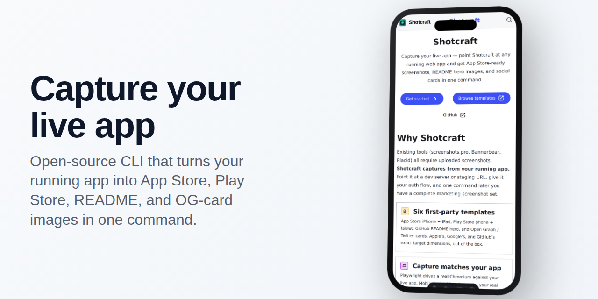

<picture>
  <source media="(prefers-color-scheme: dark)" srcset="./assets/readme/hero-dark.png">
  
</picture>

# Shotcraft

> Capture your live app and ship App Store-ready screenshots, README hero images, and social cards in one command.

[](https://www.npmjs.com/package/shotcraft)
[](https://github.com/miopea/shotcraft/actions/workflows/ci.yml)
[](LICENSE)

Most screenshot tools (screenshots.pro, Bannerbear, Placid) require you
to take screenshots first, then upload them. **Shotcraft does both
halves**: it logs into your running web app via Playwright, captures
every screen at every viewport you need, and composites the raws
through device-frame templates into shippable images for the App Store,
Play Store, your README, and social cards.

The hero above? Rendered by Shotcraft itself, against the
[Shotcraft docs site](https://shotcraft.dev). Eat-our-own-dogfood
proof.

## Quickstart

```bash
pnpm add -D shotcraft \
  @shotcraft/template-app-store-iphone \
  @shotcraft/template-readme-hero
pnpm shotcraft init       # scaffold shotcraft.config.ts
pnpm shotcraft doctor     # sanity-check the config
pnpm shotcraft            # capture + render end-to-end
```

PNGs land in `screenshots/{template-id}/{name}-{theme}.png`, ready to
upload to App Store Connect, drop into your README, or post on Twitter.

→ [Full getting-started walk-through](https://shotcraft.dev/getting-started/)

**Try the gallery + config builder today** without installing anything —
the hosted companion is live at
[shotcraft-web.azurewebsites.net](https://shotcraft-web.azurewebsites.net)
(swaps to `shotcraft.dev` once the apex domain is wired up).

## What sets it apart

- **Captures from your live app** — no manual screenshot uploads. Point
  it at your dev server, staging URL, or production.
- **Multi-output, one config** — App Store iPhone + iPad, Play Store
  phone + tablet, README hero, OG card, all from the same source
  captures.
- **Templates as code** — visual brand lives in HTML/CSS files,
  version-controlled, diff-able in PRs. No vendor lock-in, no SaaS
  subscription, no monthly render quotas.
- **Authentic auth** — pass a `setup(page)` function with full Playwright
  access. Handles OAuth, email + password, magic link, JWT, anything you
  can script.
- **Marketplace-ready** — first-party templates ship as
  `@shotcraft/template-*` packages; community templates publish under
  `shotcraft-template-*` and auto-discover on install.

## First-party templates

Six templates ship in v0.1, covering the full OSS-developer lifecycle:

| Template                                | Output (px) | Use case                                    |
| --------------------------------------- | ----------- | ------------------------------------------- |
| `@shotcraft/template-app-store-iphone`  | 1284 × 2778 | Apple App Store iPhone 6.5" (required tier) |
| `@shotcraft/template-app-store-ipad`    | 2064 × 2752 | Apple App Store iPad 13" (required tier)    |
| `@shotcraft/template-play-store-phone`  | 1080 × 1920 | Google Play phone screenshot                |
| `@shotcraft/template-play-store-tablet` | 1920 × 1200 | Google Play 7" tablet (landscape)           |
| `@shotcraft/template-readme-hero`       | 1280 × 640  | GitHub README hero (`<picture>`-ready)      |
| `@shotcraft/template-social-og-card`    | 1200 × 630  | Open Graph / Twitter card                   |

Visual previews: [shotcraft.dev/templates](https://shotcraft.dev/templates/).

## Example: drive your app, get every screenshot

```ts
// shotcraft.config.ts
import { defineConfig } from "shotcraft";

export default defineConfig({
  target: "http://localhost:5173",

  setup: async (page) => {
    await page.goto("http://localhost:5173/login");
    await page.evaluate(async () => {
      await fetch("/api/auth/login", {
        method: "POST",
        headers: { "Content-Type": "application/json" },
        credentials: "include",
        body: JSON.stringify({ email: "demo@app.com", password: "..." }),
      });
    });
  },

  screens: [
    { route: "/", name: "01-home", caption: "See everything at a glance" },
    { route: "/cashflow", name: "02-cashflow", caption: "Track every dollar" },
    { route: "/insights", name: "03-insights", caption: "Get personalized AI guidance" },
  ],

  templates: [
    "@shotcraft/template-app-store-iphone",
    "@shotcraft/template-app-store-ipad",
    "@shotcraft/template-readme-hero",
    "@shotcraft/template-social-og-card",
  ],
});
```

```bash
pnpm shotcraft           # 3 screens × 4 templates × ~2 themes = 24 PNGs
```

A real config consuming all six templates lives at
[`examples/budgetbug/`](./examples/budgetbug) — it's the canonical demo
against the BudgetBug app.

## Documentation

The full docs site is at **[shotcraft.dev](https://shotcraft.dev)**:

- [Getting started](https://shotcraft.dev/getting-started/)
- [Config reference](https://shotcraft.dev/config/) — every field on `defineConfig`
- [CLI reference](https://shotcraft.dev/cli/) — every subcommand and flag
- [Templates gallery](https://shotcraft.dev/templates/) — visual previews
- [Build your own template](https://shotcraft.dev/contributing/templates/)

Source for the docs site lives at [`docs/`](./docs).

## Repo layout

```
shotcraft/
├── packages/
│   ├── core/                          → npm: shotcraft (CLI + programmatic API)
│   ├── template-app-store-iphone/     → npm: @shotcraft/template-app-store-iphone
│   ├── template-app-store-ipad/
│   ├── template-play-store-phone/
│   ├── template-play-store-tablet/
│   ├── template-readme-hero/
│   ├── template-social-og-card/
│   └── web/                           → npm: @shotcraft/web (hosted companion site)
├── examples/
│   ├── budgetbug/                     # canonical real-world demo
│   └── shotcraft-docs/                # eat-our-own-dogfood — produced this README's hero
├── docs/                              # Astro Starlight docs (shotcraft.dev)
└── .changeset/                        # Changesets versioning
```

Built as a pnpm workspace. Standard commands from the repo root:

```bash
pnpm install                # workspace install
pnpm typecheck              # all packages
pnpm lint                   # ESLint, zero warnings
pnpm test                   # Vitest, all packages (includes Playwright snapshots)
pnpm build                  # build core + every template + docs
pnpm changeset              # record a version-bump intent
```

## Contributing

Templates are the place where Shotcraft most directly benefits from
contributions. The package contract is small — see
[Build your own template](https://shotcraft.dev/contributing/templates/)
for the walkthrough. Community templates publish under
`shotcraft-template-*`; they auto-discover on install via
`shotcraft doctor`.

For bug reports and feature requests, please open an issue on GitHub.
PRs welcome — keep them focused, include a test, and add a
[Changeset](./.changeset/README.md) entry describing the bump.

## Status

🟢 **v0.1 ready to publish.** All eight phases of the v1 plan have
landed:

- Capture engine + render engine (`shotcraft` CLI + programmatic API)
- Six first-party template packages, each with sample composites
- BudgetBug example + eat-our-own-dogfood example (the README hero
  above)
- Astro Starlight docs site (live at the BFG-managed mirror today;
  swaps to `shotcraft.dev` when the apex is bought)
- Hosted companion (`@shotcraft/web`) — templates gallery + config
  builder + `/api/templates`, deployed to Azure App Service
- npm publish plumbing — Changesets, GitHub Actions, provenance —
  awaiting operator-side prereqs (`@shotcraft` scope, GitHub repo,
  `NPM_TOKEN`)

See [the v1 plan](./.claude/plans/shotcraft-v1.md) for the design
decisions and [`PUBLISHING.md`](./PUBLISHING.md) for the remaining
operator-side prerequisites and the Azure deployment recipes.

## License

[MIT](./LICENSE) — miopea.
