# Templates gallery

Visual previews of every first-party Shotcraft template, rendered
against a real app.

Six first-party templates ship today. Each is its own npm package —
install only the ones you need. The previews below were rendered by
Shotcraft itself against the [BudgetBug](https://budgetbug.live) example
app. Source for each template is in
[`packages/template-*`](../packages).

## App Store iPhone

Apple's iPhone 6.5" tier — required for App Store Connect submissions.

`@shotcraft/template-app-store-iphone` · 1284 × 2778 · dark + light

| Dark                                                                                              | Light                                                                                               |
| ------------------------------------------------------------------------------------------------- | --------------------------------------------------------------------------------------------------- |
| 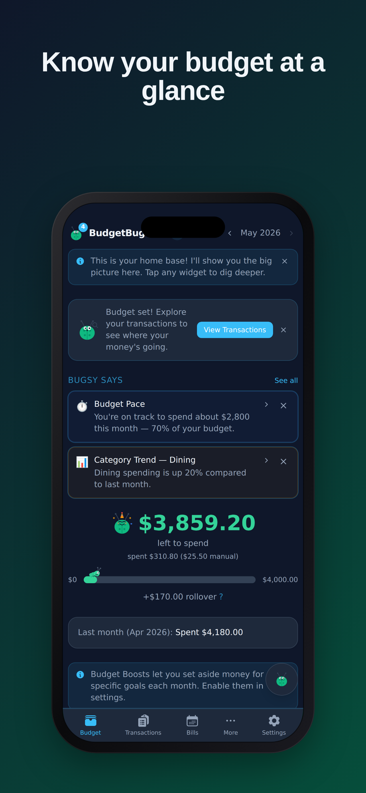 | 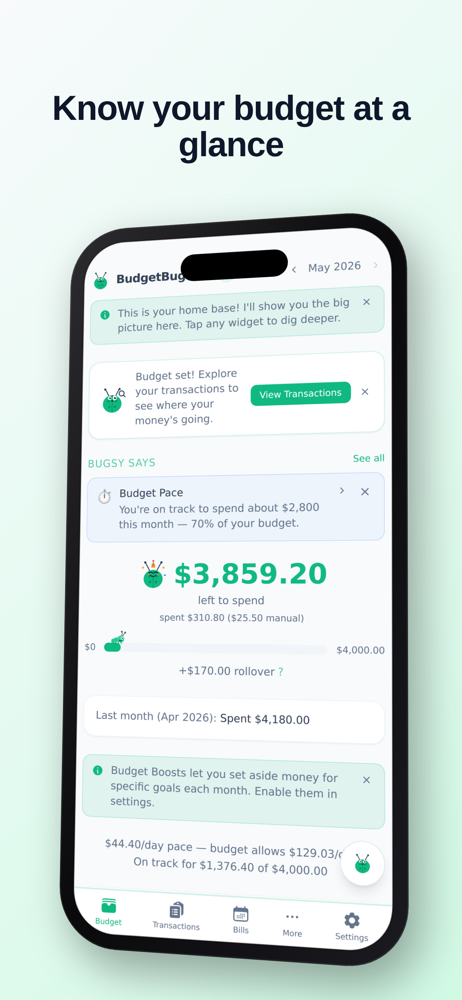 |

## App Store iPad

Apple's iPad 13" tier — required for App Store Connect submissions when
your app declares iPad support.

`@shotcraft/template-app-store-ipad` · 2064 × 2752 · dark + light

| Dark                                                                                          | Light                                                                                           |
| --------------------------------------------------------------------------------------------- | ----------------------------------------------------------------------------------------------- |
| 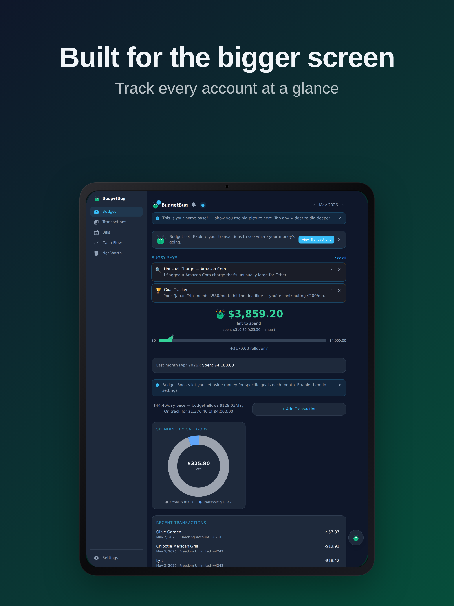 | 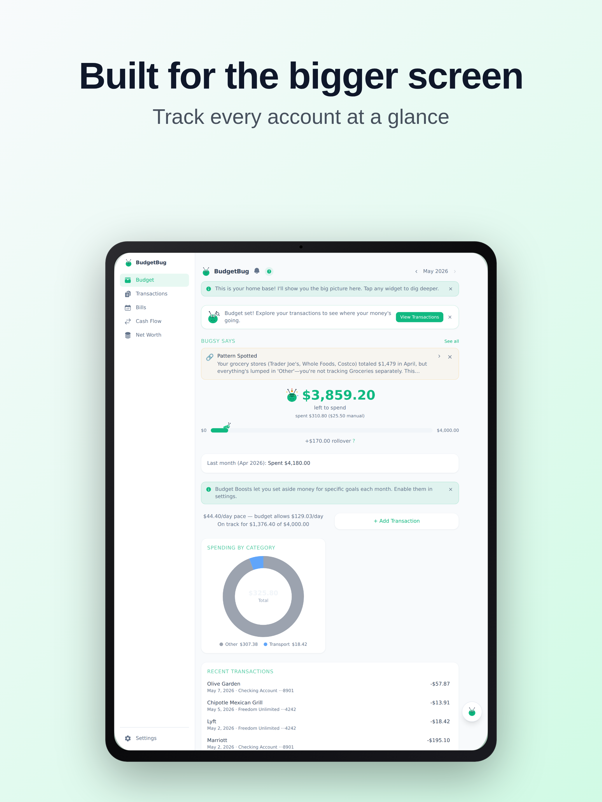 |

## Play Store phone

Google Play's recommended phone screenshot tier. Brighter Material-coded
gradient holds attention against Play Store's busy UI.

`@shotcraft/template-play-store-phone` · 1080 × 1920 · dark + light

| Dark                                                                                              | Light                                                                                               |
| ------------------------------------------------------------------------------------------------- | --------------------------------------------------------------------------------------------------- |
| 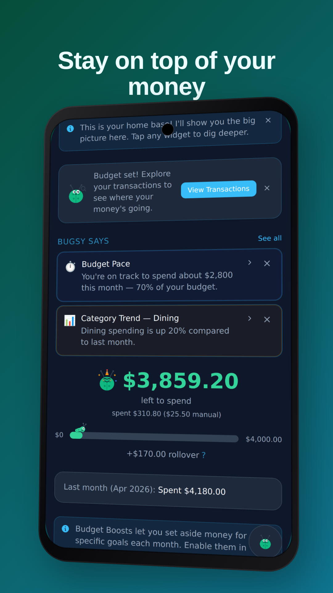 | 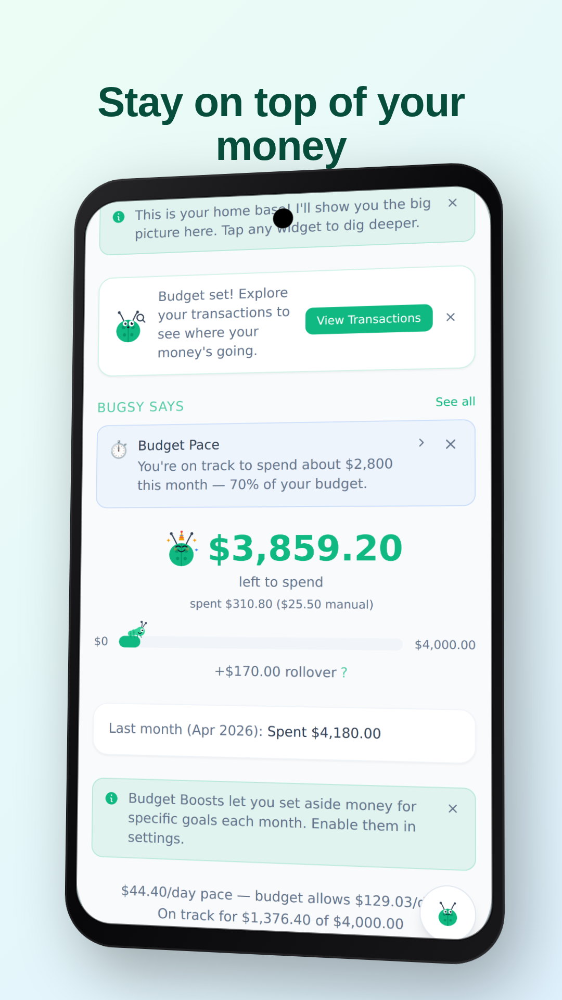 |

## Play Store tablet

Google Play's 7" tablet tier (16:10 landscape). Asymmetric two-pane
layout with the device tilted toward the viewer.

`@shotcraft/template-play-store-tablet` · 1920 × 1200 · dark + light

| Dark                                                                                                | Light                                                                                                 |
| --------------------------------------------------------------------------------------------------- | ----------------------------------------------------------------------------------------------------- |
| 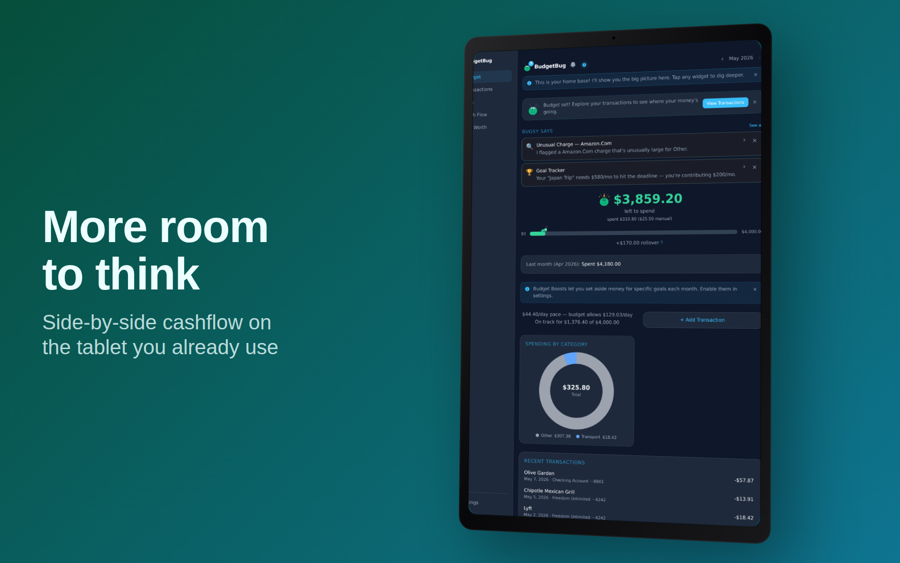 | 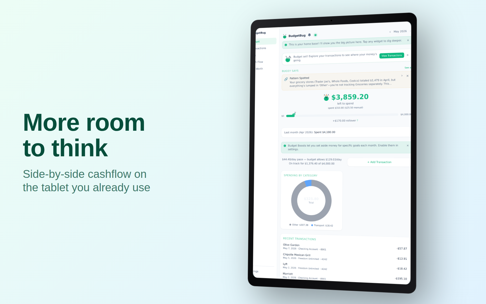 |

## README hero

GitHub README hero image — sized to fit a typical README content column
on desktop and mobile-rendered docs. Both themes ship as separate
composites so you can swap with `<picture>` and `prefers-color-scheme`:

```html
<picture>
  <source media="(prefers-color-scheme: dark)" srcset="./screenshots/readme-hero/hero-dark.png" />
  
</picture>
```

`@shotcraft/template-readme-hero` · 1280 × 640 · dark + light

| Dark                                                                               | Light                                                                                |
| ---------------------------------------------------------------------------------- | ------------------------------------------------------------------------------------ |
| 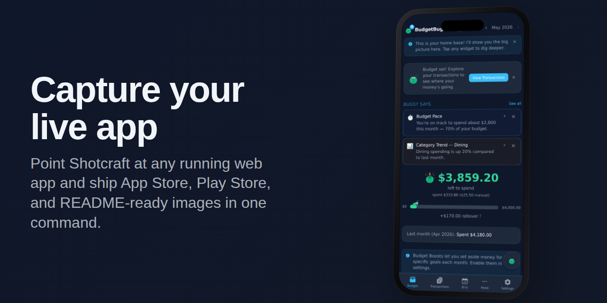 | 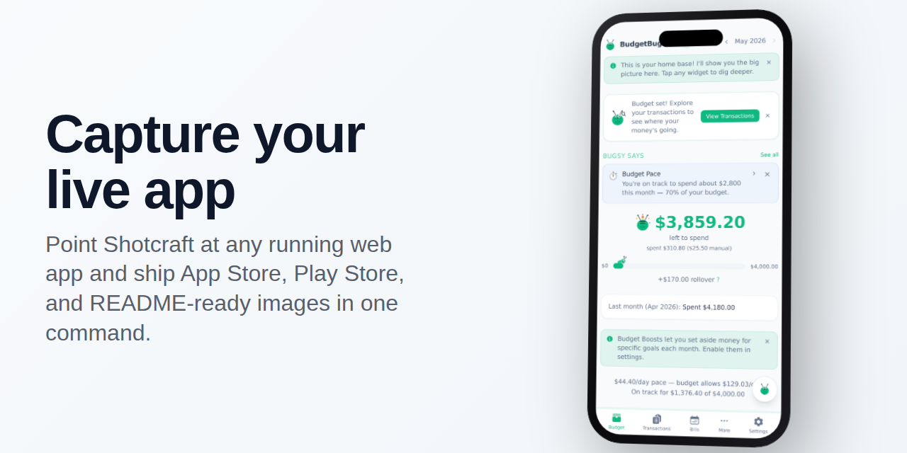 |

## Open Graph / Twitter card

Open Graph (1200 × 630) — the standard size Twitter, Slack, Discord,
LinkedIn, Notion, etc. all preview against. Single dark theme by design,
caption-dominant for thumbnail legibility.

`@shotcraft/template-social-og-card` · 1200 × 630 · dark only

| Dark                                                                                     |
| ---------------------------------------------------------------------------------------- |
| 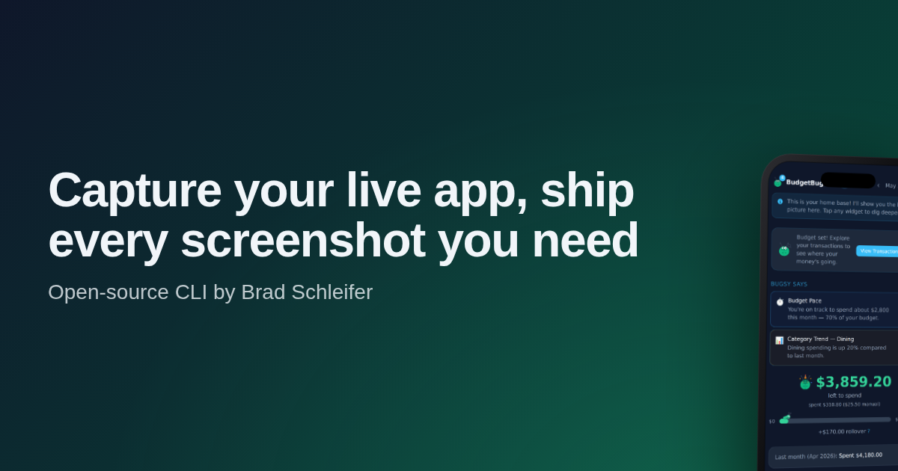 |

## Building your own

Templates are regular npm packages. The contract is small — see
[Build your own template](./contributing-templates.md) for the
end-to-end walkthrough.
